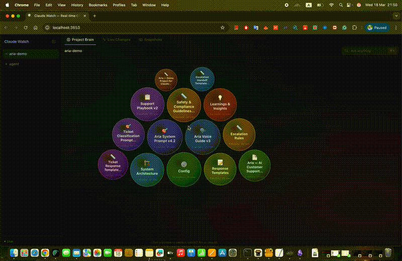

<div align="center">

# Claude Watch

### See Inside Your AI Coding Sessions

**Open-source observability dashboard for Claude Code.**<br>
Visualize your project's logic, track changes, and search with AI.

[](http://makeapullrequest.com)
[](https://opensource.org/licenses/MIT)
[](https://www.linkedin.com/in/nir-diamant-759323134/)
[](https://twitter.com/NirDiamantAI)
[](https://discord.gg/cA6Aa4uyDX)
[](https://github.com/sponsors/NirDiamant)

</div>

## 📫 Stay Updated

<div align="center">
<table>
<tr>
<td align="center">🚀<br><b>Cutting-edge<br>Updates</b></td>
<td align="center">💡<br><b>Expert<br>Insights</b></td>
<td align="center">🎯<br><b>Top 0.1%<br>Content</b></td>
</tr>
</table>

[](https://diamantai.substack.com/?r=336pe4&utm_campaign=pub-share-checklist)

*Join over 50,000 AI enthusiasts getting unique cutting-edge insights and free tutorials!*
</div>

[](https://diamantai.substack.com/?r=336pe4&utm_campaign=pub-share-checklist)

---

## Demo

<div align="center">



</div>

---

## What It Does

Claude Watch **auto-discovers** every logic file in your project (system prompts, voice guides, rules, configs, playbooks) and shows them as an **interactive visual map**.

- **Bubble Graph**: your project's brain as a zoomable map. Click to explore.
- **AI Search**: ask natural language questions across all your logic files.
- **Live Changes**: see what Claude Code is doing in real time.
- **Snapshots**: save and restore project state.

## Quick Start

```bash
# Clone and build
git clone https://github.com/NirDiamant/claude-watch.git
cd claude-watch
npm install && cd dashboard && npm install && cd ..
npm run build

# Start the dashboard
node dist/cli.js start

# In your project directory, set up hooks
node /path/to/claude-watch/dist/cli.js init
```

Open **http://localhost:3853** and use Claude Code normally.

### Enable AI Search

```bash
export ANTHROPIC_API_KEY=your-key
node dist/cli.js start
```

## How It Works

`claude-watch init` adds hooks to `.claude/settings.json`. Every Claude Code tool call gets captured, stored in SQLite, and broadcast to the dashboard via WebSocket.

The **brain scanner** auto-classifies your project's files by analyzing filenames and content (detecting patterns like NEVER, ALWAYS, MUST, PRIORITY).

## CLI

| Command | Description |
|---|---|
| `claude-watch start` | Launch dashboard |
| `claude-watch init` | Set up hooks in current project |
| `claude-watch init --global` | Set up hooks for all projects |
| `claude-watch snapshot <name>` | Save project state |
| `claude-watch status` | Show server stats |

## Contributing

PRs welcome! Ideas: timeline view, diff viewer, VS Code extension, export to PDF, notifications on rule changes.

## License

MIT
